# Cookie Session Auth

## 1. Cài đặt và chạy server
- Mở cmd, chuyển đến thư mục `cookie_session_auth`.
- Cài đặt package:
	```bash
	npm install
	```
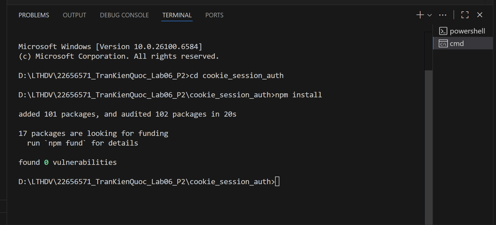
- Khởi động server:
	```bash
	node app.js
	```
	Server running on `http://localhost:3000`
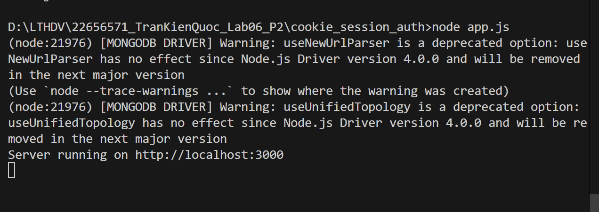
## 2. Test API với POSTMAN

### b. Register
- **Method:** POST
- **URL:** `http://localhost:3000/auth/register`
- **Body (JSON):**
	```json
	{
		"username": "admin",
		"password": "12345"
	}
	```
- **Kết quả thành công:**
	```json
	{ "message": "User registered successfully!" }
	```
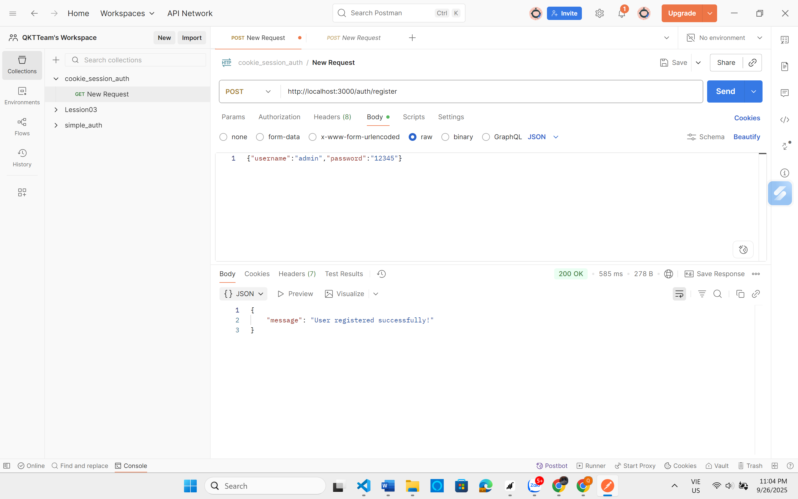
- **Kiểm tra trong MongoDB:**
	- Mở MongoDB Compass :
	- Truy cập database `SessionAuth`, collection `users`.
	- Xác nhận user mới đã được tạo.
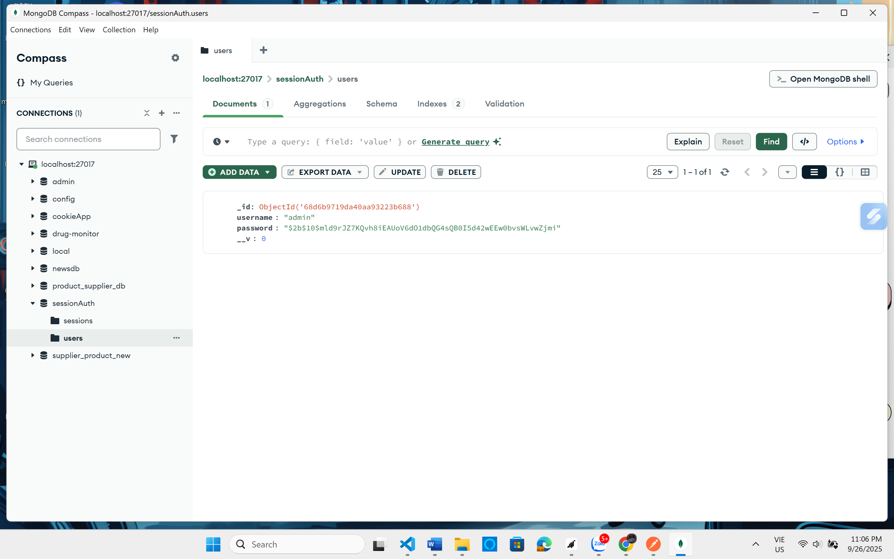   
- **Trường hợp lỗi:**
	- Trùng username: `{ "error": "User registration failed", ... }`
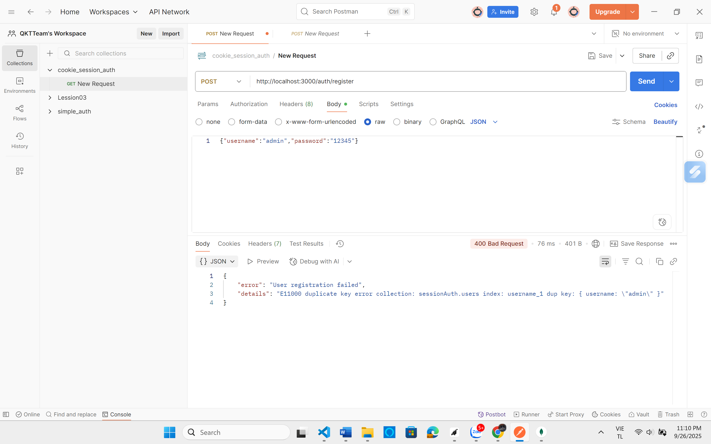  
### c. Login
- **Method:** POST
- **URL:** `http://localhost:3000/auth/login`
- **Body (JSON):**
	```json
	{
		"username": "admin",
		"password": "12345"
	}
	```
- **Kết quả thành công:**
	```json
	{ "message": "Login successful!" }
	```
  
- **Kiểm tra trong MongoDB:**
	- Collection `sessions` sẽ có session mới.
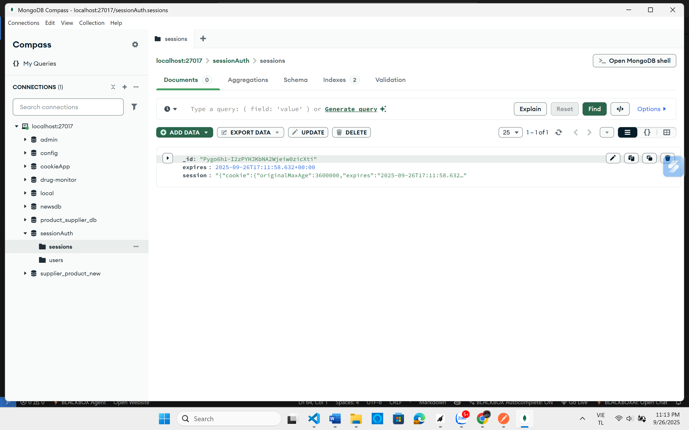  
- **Trường hợp lỗi:**
	- Sai username/password: `{ "error": "Invalid username or password" }`
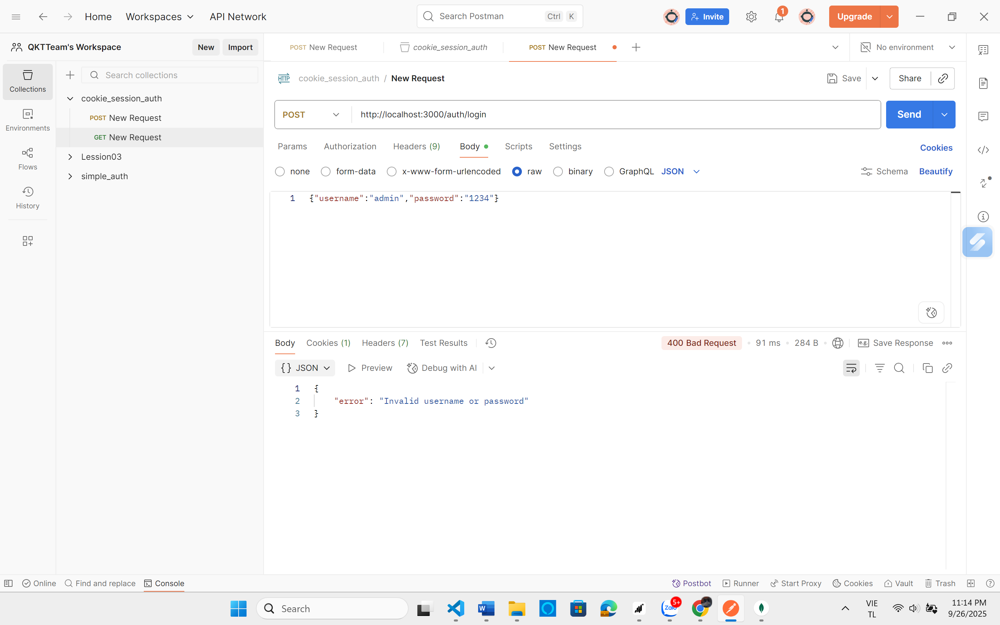  
### d. Xem thông tin cá nhân (profile)
- **Method:** GET
- **URL:** `http://localhost:3000/auth/profile`
- **Kết quả thành công:**
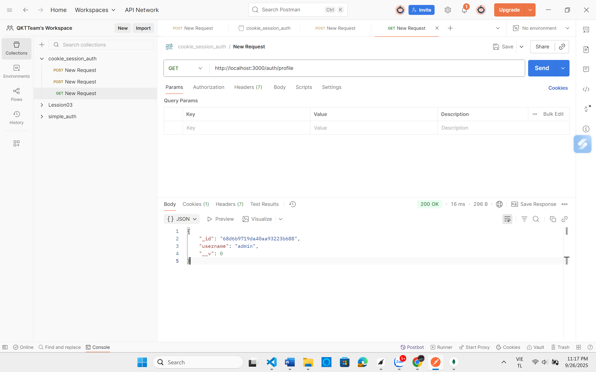  
- **Trường hợp lỗi:**
	- Chưa đăng nhập: `{ "error": "Unauthorized" }`
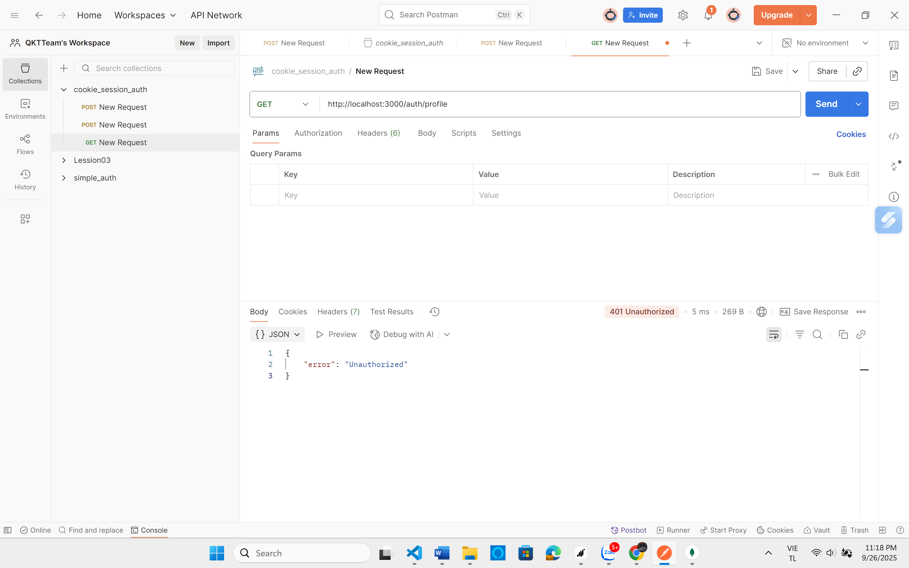  
### e. Logout
- **Method:** GET
- **URL:** `http://localhost:3000/auth/logout`
- **Kết quả thành công:**
	```json
	{ "message": "Logout successful!" }
	```
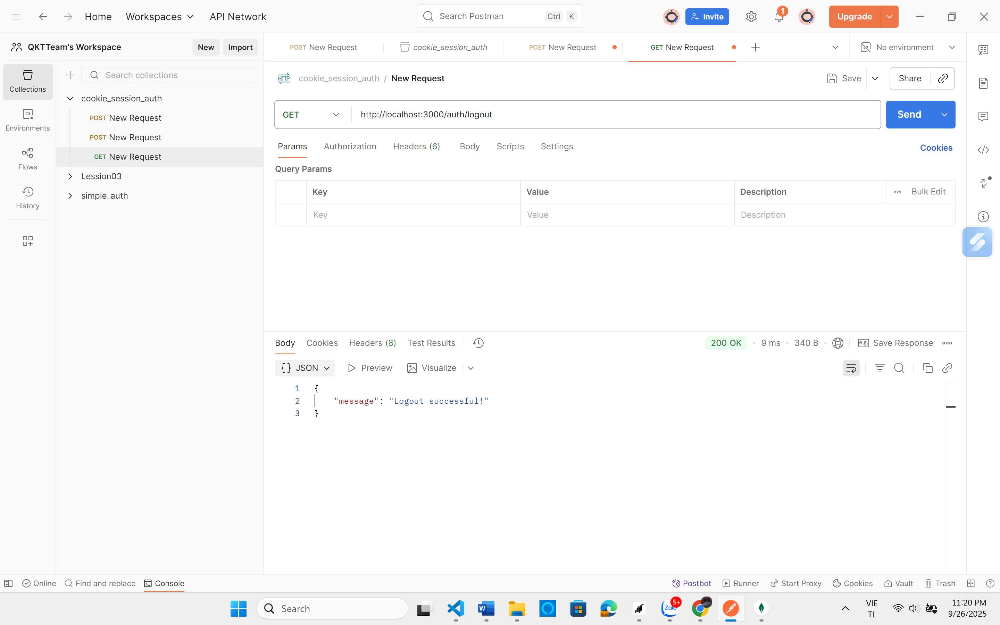  
- **Kiểm tra trong MongoDB:**
	- Collection `sessions` sẽ bị xóa session tương ứng.
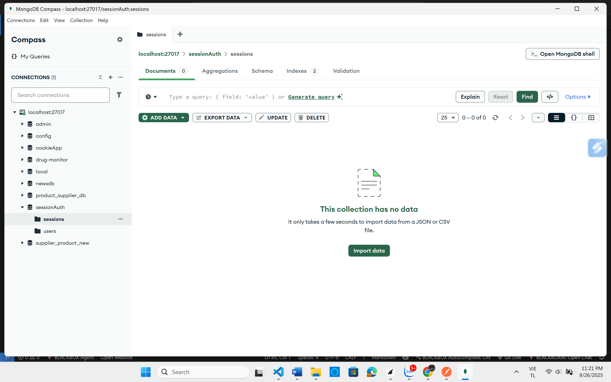  
